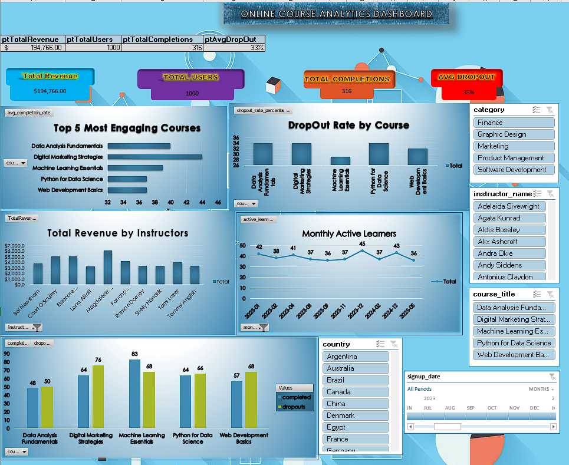

# 🎓 Online Course Platform Analytics Dashboard



## 📌 Project Overview
This project is an **interactive Excel dashboard** built on top of **PostgreSQL** and **Power Pivot**.  
It analyzes user behavior, revenue trends, and dropout patterns of an online course platform (like Coursera/Udemy).  
The dashboard brings together multiple datasets and SQL-generated outputs into a **single connected data model** with interactive slicers and KPI cards.

---

## ✨ Key Features
✅ **KPI Cards**
- 💰 **Total Revenue** – Sum of all course fees  
- 👥 **Total Users** – Unique learners on the platform  
- ✅ **Total Completions** – Count of completed enrollments  
- 📉 **Average Dropout Rate** – Percentage of dropouts vs total enrollments  

📊 **Charts**
- ⭐ **Top 5 Engaging Courses**
- 📈 **Dropout Rate by Course**
- 💵 **Revenue by Instructor**
- 📅 **Monthly Active Learners**
- 🔄 **Dropouts vs Completions**

🎛 **Slicers for Interactivity**
- Course Category
- Instructor Name
- Course Title
- Country
- Signup Month

---

## 🛠️ Tech Stack
| Tool | Purpose |
|------|---------|
| **PostgreSQL** | Data preparation, SQL aggregations |
| **Excel (Power Pivot)** | Data modeling, DAX measures, dashboard creation |
| **Mockaroo** | Synthetic data generation |
| **GitHub** | Portfolio hosting |

---

## 📂 Repository Structure
| Folder/File | Description |
|-------------|-------------|
| `/data/` | All source CSVs (users, courses, instructors, enrollments, progress) |
| `/sql/` | SQL scripts used to generate aggregated output tables |
| `/excel/OnlineCourseDashboard.xlsx` | Final Excel dashboard file |
| `/assets/dashboard_screenshot.png` | Screenshot of the finished dashboard |
| `OnlineCourse_CaseStudy.pdf` | Detailed PDF case study with process & insights |
| `README.md` | This documentation |
| `LICENSE.md` |

---

## 📊 Dashboard Preview


---

## 🚀 How to Use
1. **Clone this repository:**
   ```bash
   git clone https://github.com/RajSingh-123/Online-Course-Dashboard.git

2. **Open the dashboard:**
- Go to excel/OnlineCourseDashboard.xlsx
- Make sure you’re using Excel 2016 or later with Power Pivot enabled

3. **Interact:**
- Use the slicers (category, instructor, course title, status, country, signup month)
- Watch KPI cards and all charts update instantly

📄 Case Study
A detailed write-up of the business problem, data model, process, and insights is included:
👉 👉 [**Download Full Case Study (PDF)**](OnlineCourse_CaseStudy.pdf)


🌟 Highlights
✔️ Unified Data Model combining main and SQL output tables
✔️ Recruiter-friendly dashboard with clear KPIs
✔️ End-to-end workflow: SQL → Excel → Visualization
✔️ Demonstrates real-world analytics thinking

💡 Example Business Insights
📈 Digital Marketing and Data Analysis were the most engaging courses (highest completion rates)

📉 Machine Learning Essentials showed high dropout rates (~45%)

💵 Instructor Agata Kunrad generated the highest revenue despite fewer courses

🌍 Most active learners were from specific high-engagement regions

(For full details, see the Case Study PDF)

👨‍💻 Author
Raj Singh
📧 rajsingh3706@email.com
🌐 https://github.com/RajSingh-123

📜 License
This project is licensed under the MIT License – see LICENSE.md for details.
